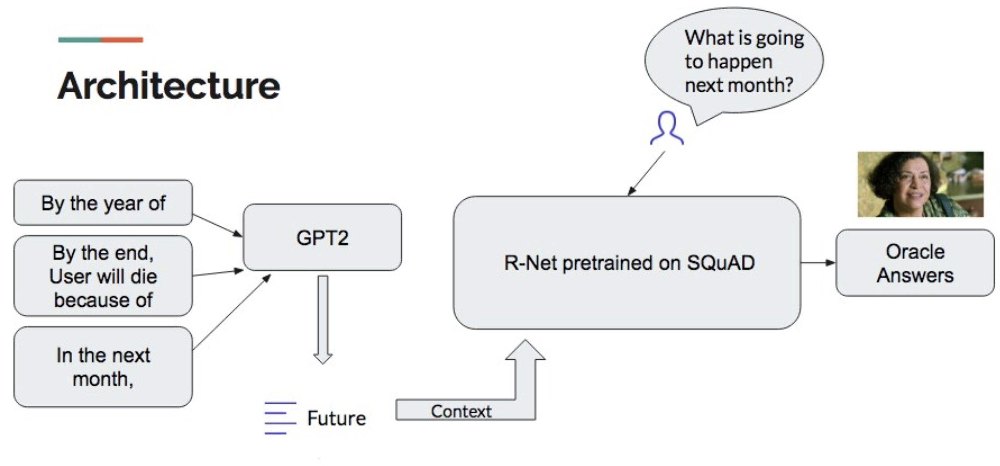

# Authors

[Beatriz Albiero](https://github.com/beatrizalbiero), Estevao Uyra, [Manuel Ciosici](https://github.com/manuelciosici)

# The Oracle Bot

This project was created during the 2nd Computational Intelligence Summer School on deep learning and dialog systems. The school took place in Lowell, organized by the Text Machine Lab of UMass Lowell and Neural Networks and Deep Learning Lab at MIPT (iPavlov project), Moscow.

The final bot is schematized in the figure below. It works on Telegram, but requires computational resources to run the GPT-2 text generation. 

To run the bot yourself, just clone the repository, `make install` and `make run`. Just make sure the telegram_token file contains a valid telegram token for your bot. 

